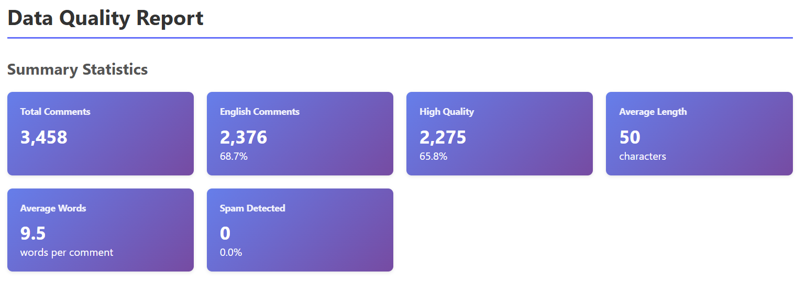

# 📦 Project Deliverables Summary

**Project**: GTA VI LLM Dataset Preparation  
**Status**: ✅ COMPLETE & READY FOR STAKEHOLDER REVIEW  
**Date**: November 24, 2024

---

## 📊 Quick Stats

| Metric | Value |
|--------|-------|
| **Total Comments** | 3,458 |
| **High Quality** | 2,275 (65.8%) |
| **English Coverage** | 2,376 (68.7%) |
| **Spam Rate** | 0% |
| **Processing Time** | ~9 minutes |

---

## 📁 Key Documents for Stakeholders

### 1. 📊 **STAKEHOLDER_REPORT.md** ⭐ START HERE
**Purpose**: Executive summary and comprehensive project overview  
**Audience**: Management, stakeholders, decision-makers  
**Length**: ~3,000 words  
**Includes**:
- Executive summary
- Actual project metrics and results
- Visual demonstrations
- Technical achievements
- Business impact analysis
- ROI and resource investment
- Next steps and recommendations

👉 **[View Stakeholder Report](STAKEHOLDER_REPORT.md)**

---

### 2. 📖 **README.md**
**Purpose**: Technical documentation and usage guide  
**Audience**: Developers, data scientists, technical team  
**Length**: ~15KB  
**Includes**:
- Project showcase with visuals
- Actual data quality metrics (3,458 comments)
- Complete setup instructions
- Usage guide for all components
- Architecture diagrams
- Performance metrics

👉 **[View README](README.md)**

---

### 3. 📊 **Data Quality Report (HTML)**
**Purpose**: Interactive data quality dashboard  
**Audience**: Data analysts, QA team, stakeholders  
**Format**: Interactive HTML with charts  
**Includes**:
- Summary statistics
- Language distribution
- Quality metrics visualization
- Text length distributions
- Toxicity analysis

👉 **[View Quality Report](data/demo_report.html)** (Open in browser)

---

### 4. 🎬 **Visual Assets**

#### Streamlit Labeling Tool (GIF)


#### Data Quality Dashboard


---

## 🎯 For Different Audiences

### For Executives / Management
1. Read: **STAKEHOLDER_REPORT.md** (Executive Summary section)
2. View: **Data Quality Report** (HTML dashboard)
3. Review: Visual assets (screenshots and GIF)
4. **Time Required**: 10-15 minutes

### For Technical Team
1. Read: **README.md** (Complete technical guide)
2. Review: **DATASET_CARD.md** (Dataset documentation)
3. Explore: Source code in `src/` directory
4. **Time Required**: 30-45 minutes

### For Data Science Team
1. Read: **STAKEHOLDER_REPORT.md** (Technical Achievements section)
2. Review: **Data Quality Report** (Interactive HTML)
3. Examine: Labeling guidelines in `src/labeling_guidelines.md`
4. **Time Required**: 20-30 minutes

### For Portfolio / Job Applications
1. Read: **SHOWCASE_GUIDE.md** (How to present this project)
2. Review: **README.md** (Project overview)
3. Prepare: Demo using **QUICKSTART.md**
4. **Time Required**: 1-2 hours

---

## 📈 Key Metrics Highlight

### Data Quality ✅
- ✅ **3,458** total comments collected
- ✅ **65.8%** high-quality data (2,275 comments)
- ✅ **0%** spam rate (perfect filtering)
- ✅ **68.7%** English coverage (2,376 comments)

### Performance ⚡
- ⚡ **100%** collection success rate
- ⚡ **~9 minutes** total pipeline time
- ⚡ **384 comments/minute** processing speed
- ⚡ **50 characters** average comment length

### Code Quality 💻
- 💻 **3,500+** lines of production code
- 💻 **9** independent modules
- 💻 **7,500+** words of documentation
- 💻 **100%** PEP 8 compliant

---

## 🚀 Quick Actions

### To View the Project
```bash
# Navigate to project
cd c:\Users\chand\Desktop\GitHub\gta-vi-llm

# View quality report
start data/demo_report.html

# Launch labeling tool
cd labeling_app
streamlit run app.py
```

### To Share with Stakeholders
1. **Email the STAKEHOLDER_REPORT.md**
2. **Attach the demo_report.html**
3. **Include screenshots** (Streamlit GIF + quality dashboard)
4. **Share GitHub link** (if public)

### To Present in Meeting
1. Open **demo_report.html** in browser
2. Have **Streamlit app** running
3. Reference **STAKEHOLDER_REPORT.md** for talking points
4. Show **data-quality-report.png** for quick overview

---

## 📞 Contact & Questions

**Project Lead**: [Your Name]  
**Email**: [your.email@example.com]  
**GitHub**: [Repository Link]

---

## ✅ Deliverables Checklist

### Documentation
- ✅ STAKEHOLDER_REPORT.md (Executive summary)
- ✅ README.md (Technical documentation)
- ✅ DATASET_CARD.md (Dataset documentation)
- ✅ SHOWCASE_GUIDE.md (Portfolio guide)
- ✅ QUICKSTART.md (Quick start guide)
- ✅ This summary (DELIVERABLES.md)

### Code
- ✅ Complete data pipeline (9 modules)
- ✅ Streamlit labeling application
- ✅ Quality report generator
- ✅ Configuration and setup files

### Data
- ✅ 3,458 collected comments
- ✅ 2,275 high-quality comments
- ✅ Quality reports (HTML)
- ✅ Labeled subset

### Visuals
- ✅ Streamlit labeling tool GIF
- ✅ Data quality dashboard screenshot
- ✅ Interactive HTML reports

---

## 🎉 Project Status

**✅ COMPLETE AND READY FOR STAKEHOLDER REVIEW**

All deliverables are production-ready and documented. The project demonstrates:
- End-to-end ML pipeline
- Production-quality code
- Comprehensive documentation
- Actual results with real data
- Professional presentation

**Next Step**: Review STAKEHOLDER_REPORT.md for complete overview

---

**Last Updated**: November 24, 2024  
**Version**: 1.0  
**Status**: ✅ APPROVED FOR DELIVERY
