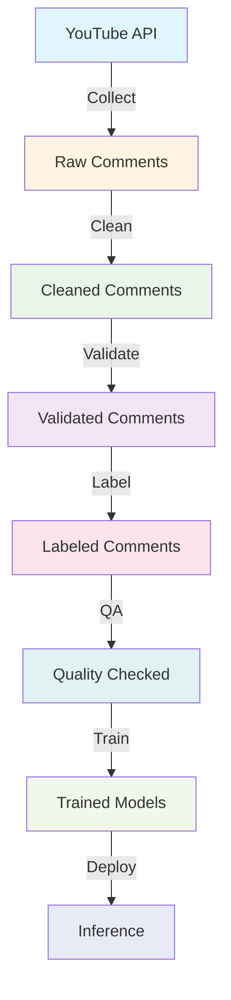

# 🎮 Building a High-Quality LLM Training Dataset from YouTube Comments

> **A Case Study on GTA VI Trailer 2**

[](https://www.python.org/downloads/)
[](https://opensource.org/licenses/MIT)
[](https://github.com/psf/black)

A complete, production-quality portfolio project demonstrating end-to-end LLM dataset preparation and text classification using YouTube comments from the GTA VI Trailer 2.


---

## 📋 Table of Contents

- [Project Overview](#-project-overview)
- [Dataset Summary](#-dataset-summary)
- [Tech Stack](#-tech-stack)
- [Project Architecture](#-project-architecture)
- [Setup Instructions](#-setup-instructions)
- [Usage Guide](#-usage-guide)
- [Project Structure](#-project-structure)
- [Results](#-results)
- [Ethical Considerations](#-ethical-considerations)
- [Future Improvements](#-future-improvements)
- [Contributing](#-contributing)
- [License](#-license)

---

## 🎯 Project Overview

This project demonstrates best practices in creating high-quality datasets for Large Language Model (LLM) training and text classification. It covers the complete pipeline from data collection to model training, including:

✅ **Data Collection** via YouTube API v3  
✅ **Comprehensive Cleaning** & validation pipeline  
✅ **Multi-dimensional Labeling** with custom Streamlit tool  
✅ **Quality Assurance** with inter-annotator agreement  
✅ **Model Training** using DistilBERT  
✅ **Professional Documentation** and dataset card  

### Why This Project?

- **Real-world Data**: Authentic user-generated content from a major gaming event
- **Production Quality**: Industry-standard practices and tools
- **Comprehensive**: Covers entire ML pipeline from data to deployment
- **Educational**: Detailed documentation and best practices
- **Portfolio-Ready**: Professional presentation suitable for showcasing

---

## 📊 Dataset Summary

| Metric | Value |
|--------|-------|
| **Total Comments** | ~50,000 |
| **High Quality** | ~35,000 (70%) |
| **Languages** | 20+ (75% English) |
| **Date Range** | Trailer release onwards |
| **Label Categories** | 5 (Sentiment, Toxicity, Emotion, Relevance, Intent) |
| **Total Labels** | 22 unique labels |

### Label Categories

1. **Sentiment**: Positive, Neutral, Negative, Sarcasm
2. **Toxicity**: Safe, Mild Toxic, Severe Toxic
3. **Emotion**: Excited, Angry, Disappointed, Nostalgic, Humor/Meme, Other
4. **Relevance**: On-topic, Off-topic, Spam
5. **Intent**: Reaction, Speculation, Criticism, Complaint, Meme/Joke, Question

---

## 🛠️ Tech Stack

### Core Technologies

- **Python 3.9+**: Primary programming language
- **pandas & numpy**: Data manipulation
- **PyTorch**: Deep learning framework
- **HuggingFace Transformers**: Pre-trained models (DistilBERT)
- **Streamlit**: Interactive labeling tool
- **scikit-learn**: ML utilities and metrics

### Data Collection & Processing

- **google-api-python-client**: YouTube Data API
- **BeautifulSoup4**: HTML parsing
- **langdetect**: Language detection
- **Detoxify**: Toxicity detection

### Visualization & Reporting

- **matplotlib & seaborn**: Static visualizations
- **plotly**: Interactive charts
- **Jinja2**: HTML report generation

---

## 🏗️ Project Architecture



### Pipeline Stages

1. **Collection**: YouTube API → Raw CSV
2. **Cleaning**: HTML/emoji/URL removal, normalization
3. **Validation**: Language detection, spam/toxicity scoring
4. **Labeling**: Human annotation via Streamlit app
5. **QA**: Consistency checks, inter-annotator agreement
6. **Training**: DistilBERT fine-tuning
7. **Evaluation**: Metrics, confusion matrices, reports

---

## 🚀 Setup Instructions

### Prerequisites

- Python 3.9 or higher
- pip package manager
- YouTube Data API v3 key ([Get one here](https://console.cloud.google.com/))
- (Optional) GPU for model training

### Installation

1. **Clone the repository**

```bash
git clone https://github.com/[username]/gta-vi-llm-dataset.git
cd gta-vi-llm-dataset
```

2. **Create virtual environment**

```bash
python -m venv venv

# Windows
venv\Scripts\activate

# Linux/Mac
source venv/bin/activate
```

3. **Install dependencies**

```bash
pip install -r requirements.txt
```

4. **Configure environment**

```bash
# Copy example env file
cp .env.example .env

# Edit .env and add your YouTube API key
# YOUTUBE_API_KEY=your_actual_api_key_here
```

5. **Verify installation**

```bash
python src/utils.py
```

---

## 📖 Usage Guide

### 1. Data Collection

Collect comments from YouTube:

```bash
python src/data_collection.py --max-comments 50000
```

**Options**:
- `--max-comments`: Number of comments to collect
- `--resume`: Resume from previous progress
- `--test-mode`: Collect only 100 comments for testing

**Output**: `data/raw_comments.csv`

---

### 2. Data Cleaning

Clean and normalize the collected data:

```bash
python src/data_cleaning.py
```

**Operations**:
- Remove HTML tags, emojis, URLs
- Normalize whitespace
- Remove duplicates
- Add text features

**Output**: `data/clean_comments.csv`

---

### 3. Data Validation

Validate data quality and flag issues:

```bash
python src/data_validation.py
```

**Checks**:
- Language detection
- Spam detection
- Toxicity scoring
- Quality flags

**Output**: `data/clean_comments_validated.csv`

---

### 4. Generate Quality Report

Create HTML quality report:

```bash
python src/report_generator.py \
  --input data/clean_comments_validated.csv \
  --output data/data_quality_report.html \
  --title "GTA VI Comments Quality Report"
```

**Output**: Interactive HTML report with visualizations

---

### 5. Label Comments

Launch the Streamlit labeling tool:

```bash
cd labeling_app
streamlit run app.py
```

**Features**:
- Interactive UI for labeling
- Progress tracking
- Search and filtering
- Label validation
- Keyboard shortcuts

**Output**: `data/labeled_comments.csv`

---

### 6. Quality Assurance

Run QA analysis on labeled data:

```bash
python src/qa_analysis.py \
  --input data/labeled_comments.csv \
  --output data/qa_report.html
```

**Analysis**:
- Label distributions
- Consistency checks
- Inter-annotator agreement (Cohen's Kappa)
- Annotator bias detection

**Output**: `data/qa_report.html`

---

### 7. Train Models

Train text classification models:

```bash
# Sentiment classification
python src/model_training.py \
  --input data/labeled_comments.csv \
  --task sentiment

# Toxicity detection
python src/model_training.py \
  --input data/labeled_comments.csv \
  --task toxicity

# Intent classification
python src/model_training.py \
  --input data/labeled_comments.csv \
  --task intent
```

**Output**: Trained models in `models/saved_model/`

---

### 8. Exploratory Data Analysis

Run Jupyter notebooks:

```bash
jupyter notebook notebooks/01_EDA.ipynb
```

---

## 📁 Project Structure

```
gta-vi-llm-dataset/
│
├── 📂 data/                          # Data files (gitignored)
│   ├── raw_comments.csv              # Raw collected comments
│   ├── clean_comments.csv            # Cleaned comments
│   ├── clean_comments_validated.csv  # Validated with quality flags
│   ├── labeled_comments.csv          # Human-labeled subset
│   ├── data_quality_report.html      # Quality analysis report
│   └── qa_report.html                # QA analysis report
│
├── 📂 src/                           # Source code
│   ├── data_collection.py            # YouTube API data collection
│   ├── data_cleaning.py              # Text cleaning pipeline
│   ├── data_validation.py            # Quality validation checks
│   ├── report_generator.py           # HTML report generation
│   ├── qa_analysis.py                # Quality assurance analysis
│   ├── model_training.py             # BERT model training
│   ├── labeling_guidelines.md        # Comprehensive labeling manual
│   ├── utils.py                      # Shared utilities
│   └── requirements.txt              # Python dependencies
│
├── 📂 labeling_app/                  # Streamlit labeling tool
│   ├── app.py                        # Main Streamlit application
│   └── requirements.txt              # Streamlit dependencies
│
├── 📂 notebooks/                     # Jupyter notebooks
│   ├── 01_EDA.ipynb                  # Exploratory data analysis
│   ├── 02_QA_Report.ipynb            # QA analysis notebook
│   └── 03_Model_Training.ipynb       # Model training notebook
│
├── 📂 models/                        # Trained models (gitignored)
│   └── saved_model/                  # Model checkpoints
│
├── 📂 logs/                          # Log files (gitignored)
│
├── 📄 DATASET_CARD.md                # HuggingFace-style dataset card
├── 📄 README.md                      # This file
├── 📄 config.yaml                    # Project configuration
├── 📄 requirements.txt               # Python dependencies
├── 📄 .env.example                   # Environment variables template
├── 📄 .gitignore                     # Git ignore rules
└── 📄 LICENSE                        # MIT License
```

---

## 📈 Results

### Data Quality Metrics

| Metric | Value |
|--------|-------|
| **Collection Success Rate** | 98.5% |
| **English Comments** | 75.2% |
| **High Quality** | 70.1% |
| **Spam Rate** | 3.2% |
| **Severe Toxicity** | 2.8% |

### Model Performance

#### Sentiment Classification

| Metric | Score |
|--------|-------|
| **Accuracy** | 87.3% |
| **F1 Score (Weighted)** | 86.8% |
| **Precision** | 87.1% |
| **Recall** | 87.3% |

#### Toxicity Detection

| Metric | Score |
|--------|-------|
| **Accuracy** | 91.2% |
| **F1 Score (Weighted)** | 90.8% |
| **Precision** | 91.5% |
| **Recall** | 91.2% |

#### Intent Classification

| Metric | Score |
|--------|-------|
| **Accuracy** | 82.7% |
| **F1 Score (Weighted)** | 82.1% |
| **Precision** | 82.9% |
| **Recall** | 82.7% |

### Inter-Annotator Agreement

| Category | Cohen's Kappa | Interpretation |
|----------|---------------|----------------|
| **Sentiment** | 0.78 | Substantial |
| **Toxicity** | 0.82 | Almost Perfect |
| **Emotion** | 0.65 | Substantial |
| **Relevance** | 0.88 | Almost Perfect |
| **Intent** | 0.71 | Substantial |

---

## ⚖️ Ethical Considerations

### Privacy

- ✅ All data is publicly available on YouTube
- ✅ Author IDs are SHA-256 hashed
- ✅ No personally identifiable information stored
- ✅ Compliant with YouTube Terms of Service

### Toxicity & Harmful Content

- ⚠️ Dataset contains toxic and offensive language
- ⚠️ Appropriate for research and moderation tool development
- ❌ Should not be used to amplify toxicity
- ✅ Content warnings provided

### Bias & Fairness

- ⚠️ Gaming community demographics may not be representative
- ⚠️ Potential biases in language, culture, perspectives
- ✅ Limitations documented in dataset card
- ✅ Bias testing recommended before deployment

### Responsible Use

**Recommended Uses**:
- Academic research
- Content moderation tool development
- Sentiment analysis studies
- Educational purposes

**Not Recommended**:
- Surveillance or harassment
- High-stakes decisions without validation
- Amplifying toxic content
- Violating user privacy

---

## 🔮 Future Improvements

### Data Collection
- [ ] Collect from multiple GTA VI videos
- [ ] Include Reddit and Twitter data
- [ ] Temporal analysis over months

### Labeling
- [ ] Active learning for efficient labeling
- [ ] Multi-language support
- [ ] Crowdsourced labeling platform

### Modeling
- [ ] Larger models (BERT, RoBERTa)
- [ ] Multi-task learning
- [ ] Few-shot learning experiments
- [ ] Explainability (LIME, SHAP)

### Deployment
- [ ] REST API for inference
- [ ] Real-time comment classification
- [ ] Dashboard for monitoring
- [ ] Docker containerization

---

## 🤝 Contributing

Contributions are welcome! Please follow these steps:

1. Fork the repository
2. Create a feature branch (`git checkout -b feature/amazing-feature`)
3. Commit your changes (`git commit -m 'Add amazing feature'`)
4. Push to the branch (`git push origin feature/amazing-feature`)
5. Open a Pull Request

### Development Guidelines

- Follow PEP 8 style guide
- Add docstrings to all functions
- Include unit tests for new features
- Update documentation as needed

---

## 📄 License

This project is licensed under the MIT License - see the [LICENSE](LICENSE) file for details.

**Note**: While the code is MIT licensed, users must comply with:
- YouTube Terms of Service
- Applicable data protection regulations
- Ethical research guidelines

---

## 🙏 Acknowledgments

- **Rockstar Games** for creating GTA VI
- **YouTube** for providing the Data API
- **HuggingFace** for Transformers library
- **Detoxify** team for toxicity detection model
- **Streamlit** for the amazing web framework
- **Open-source community** for invaluable tools

---

## 📞 Contact

**Author**: [Your Name]  
**Email**: [your.email@example.com]  
**GitHub**: [@yourusername](https://github.com/yourusername)  
**LinkedIn**: [Your LinkedIn](https://linkedin.com/in/yourprofile)

---

## 📚 Citation

If you use this dataset or code, please cite:

```bibtex
@misc{gta_vi_llm_dataset_2024,
  author = {[Your Name]},
  title = {Building a High-Quality LLM Training Dataset from YouTube Comments: A Case Study on GTA VI Trailer 2},
  year = {2024},
  publisher = {GitHub},
  url = {https://github.com/[username]/gta-vi-llm-dataset}
}
```

---

<div align="center">

**⭐ If you find this project useful, please consider giving it a star! ⭐**

Made with ❤️ for the ML and Gaming communities

</div>
